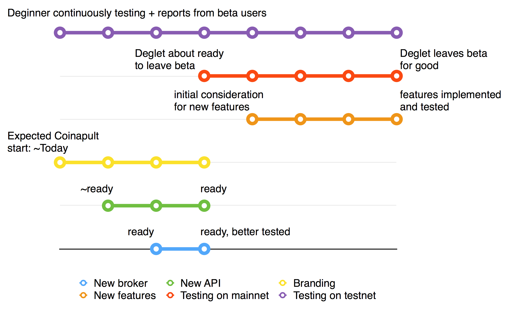

{{ page.date | date: "%b %-d, %Y" }}

## Current status

Deglet is in beta and currently provides all the core features required
for a Bitcoin wallet plus a few additional ones including Invoices,
Invoices with conversions, Conversions between dollars and bitcoins,
History filtering and exporting to CSV.

<http://deglet.xyz> runs on testnet and you can use it today for
checking out the wallet. A preview of the Developer Documentation is
available at <{{ "" | prepend: site.baseurl | prepend: site.url }}>.

## Roadmap

Today there are two main features, not visible to the user, that are
being developed: a broker service, new API.

The short-term goal for **Deginner** is to provide a broker service
(i.e. move away from simulated hedging), get into the new API
(i.e. move away from the temporary new API currently in place),
and deploy it on the main Bitcoin network. For **Coinapult**, the
expected short-term goal is to deal with branding and creation of any
new pages that it deems necessary.

The mid-term goal for both **Deginner** and **Coinapult** is to discuss
and implement features that are considered important but missing.

<figure>
  <figcaption>~Roadmap</figcaption>
  
</figure>

### Branding

Coinapult is expected to fork Deglet and freely modify templates as
necessary, as well create new pages. By restricting modifications to
template files and (S)CSS only, Coinapult will be able to maintain its
own branding without losing the ability to keep up with latest changes
from Deglet.

If other modifications are made, it's recommended to contribute those
back to Deglet. Modifications and additions involving the communication
between client and servers (e.g. authentication parameters, retry on a
timeout, refresh a page each X minutes, displaying of new kinds of
notifications or events), modifications involving the use of supporting
libraries (e.g. the forked bitcore-wallet-api, BWC <-> BWS, Insight,
react-router), and related are better done if contributed back to
Deglet or the ability to update the fork will be reduced.

Modifications involving entirely new pages unrelated to Deglet, like a
Contact page, About page, or Support page may be done without needing to
worry about Deginner / Deglet. In general, if a page doesn't affect the
behavior of existing pages then it's not necessary to try contributing
it back to Deglet (nor would it be accepted if it's specific to
Coinapult).

Steps to Branding:

1. [Fork Deglet at BitBucket](https://bitbucket.org/deginner/deglet/fork).
   This fork can be private (only the BitBucket user from Coinapult can
   access it) or public.
2. Change existing pages by modifying the files under `deglet/app/style`
   and `deglet/app/template`.
3. If you need to create a new page, consult the tutorial about [creating new pages]().
4. From time to time, merge changes from Deglet into your custom fork.
   <http://stackoverflow.com/a/9946742> provides a description of the
   steps required.

### New API and broker

These are under active development and there are no known barries that
would delay them at this moment.

### New features

Discussion of new features are expected to take place at
<https://bitbucket.org/deginner/deglet> (or if the project moves to
github, then there). Coinapult is welcome (as well any user) to suggest
features, but there's no guarantee that such features will get
implemented.

Features that are specific to Coinapult, e.g. a new Ticket page that
links support tickets to the current user, are outside the scope of
Deglet and, therefore, must be discussed out of BitBucket (BB) / GitHub (GH). If
you're not sure if a given issue is specific to Coinapult or not, then
feel free to start discussing on BB / GH and in case it doesn't fit then
it will get closed.
