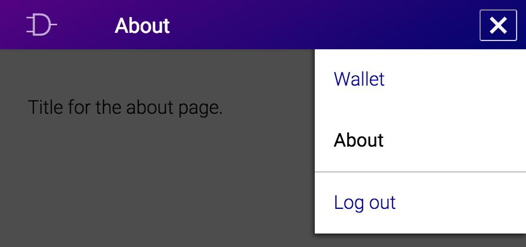

## {{ page.title }}

Requirements:
: Local Deglet instance.

In this tutorial we're going to create a new top page named "About" for
Deglet. This will involve creating:

* A new component at `app/src/component/section/About.react.js` together
  with its new template at `app/template/section/About.jsx`;
* A new route at `app/app.js` so it's possible to access the component;
* A new entry at `app/src/constant/AppLinks.js` so a link to this page
  gets displayed on the top bar;
* New keys in existing locales to deal with the new text introduced.

### Creating the new component

Every template is a JSX file that exports a single function. The
component expects to be able to require this template and use the
exported function for its render method.

In the following template you will notice that what it returns is very
similar to HTML, where the main differences are that `className` is
used in place of `class` and `{ ... }` is used to include the result
from some JS code. Check <https://facebook.github.io/react/docs/tags-and-attributes.html>
for a complete reference about HTML attributes that differ, and in case
try the [HTML to JSX Compiler](http://facebook.github.io/react/html-jsx.html).
The HTML classes `row` and `col-xs-12` are from the flexboxgrid
package, and its CSS file is loaded from `app/style/external.scss`.

<figure>
<figcaption>app/template/section/About.jsx</figcaption>

"use strict";

var React = require('react');

function template() {
  return (
    <section className="row">
      

        {this.getIntlMessage('about.title')}
      

    </section>
  );
}

module.exports = template;

</figure>

The function `getIntlMessage` will look in the active locale for a key
named `'about.title'`. If that key doesn't exist, this template will not
load. For now let's leave it like that.

Next, we need a component that loads the template created above.

<figure>
<figcaption>app/src/component/section/About.react.js</figcaption>

"use strict";

var React = require('react');
var ReactIntl = require('react-intl');
var template = require('../../../template/section/About.jsx');

var AboutSection = React.createClass({

  mixins: [ReactIntl.IntlMixin],

  render: template

});

module.exports = AboutSection;

</figure>

This is about the simplest component that we can create, all it does is
render the template defined earlier. Note that we are able to use the
`getIntlMessage` in the template only because the mixin
`ReactIntl.IntlMixin` was defined in the component.

### Creating a new route

The file `app/app.js` defines the page hierarchy by defining how the
different components are routed. In this tutorial we're creating a
public page, named "About", therefore we need to place it outside the
`Account` hierarchy. That is because routes placed under `Account` will
make sure an user is present before proceeding.

First we import the new component:


// Put the following line before `var routes = ...`
var About = require('./src/component/section/About.react');


Then add a new route for it by adding the line show next right before the
line for the `NotFoundRoute`, i.e.
`<Router.NotFoundRoute handler={NotFound} />`:


<Route name="about" handler={About} />


The new route is present, but the website does not contain any link to
this page yet.

### Linking to the top bar

Patch `app/src/constant/AppLinks.js` such that the following contents
are included right before the entry that starts with `link: "logout"`:


{
  link: "about",
  i18n: "link.about",
  parent: null
},


The key `link` refers to the name specified in the route above. The
`i18n` key will be used by Deglet to load the text to be displayed when
showing the link to this new page. The key `parent` indicates this page
has no parent page, which causes a link to it to be included in the top
bar.

### Updating the locales

Open `app/locale/en/app.json` and locate the `"link"` section. Immediately
after the last entry add a new entry for the About link: `"about":
"About"`.

In the template created above we also refer to the key `"about.title"`.
Since this is a new page, the section `"about"` does not exist yet.
Create it above the `"page_notfound"` section such that it looks like
this:


"about": {
  "title": "Title for the about page"
},


If you're using other locales, add the same keys but now with proper
translations. At this point you should be able to load the new page.

## Result

| Before   (mobile menu) | {:width="420px"} |
| After   (mobile menu) | {:width="420px"} |
